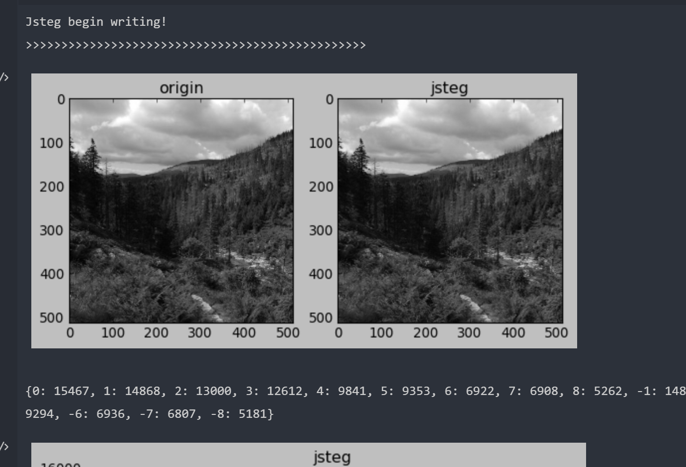
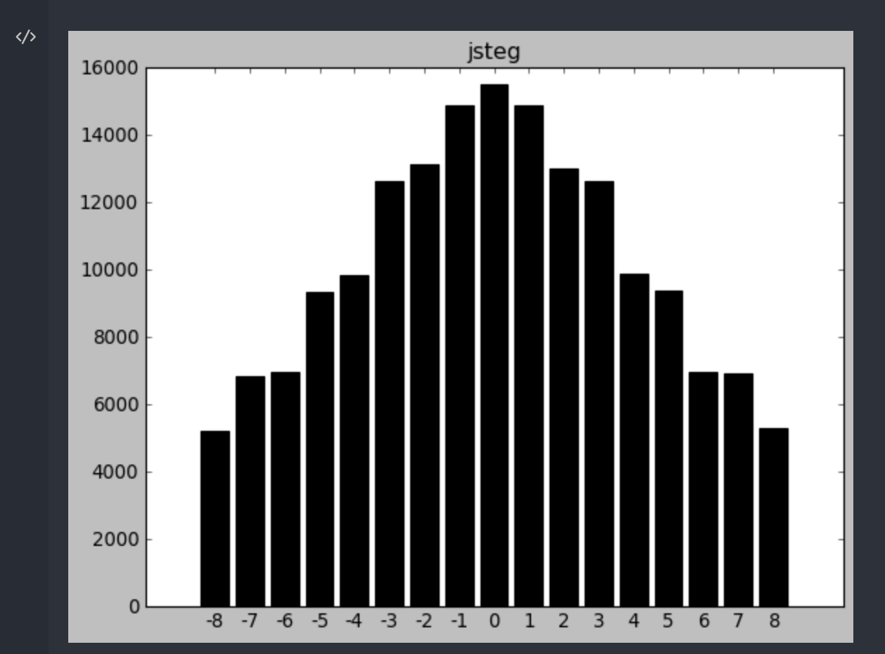
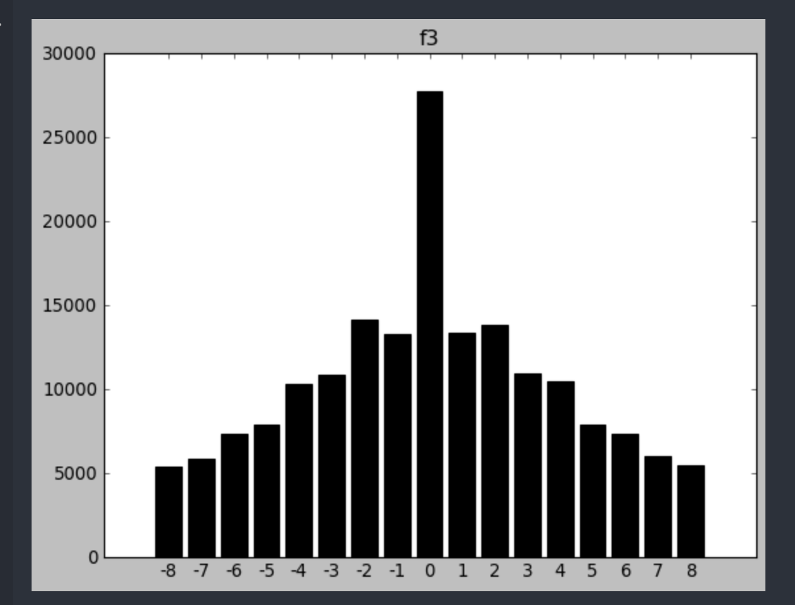
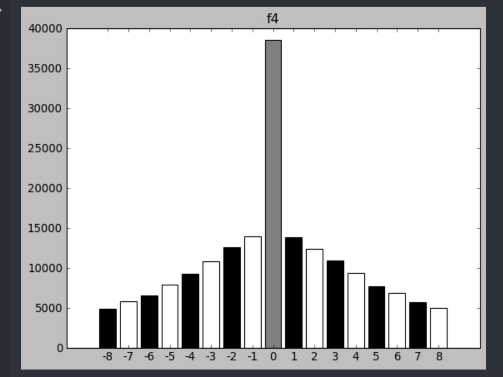

# LSB+JSTEG+F3+F4
多媒体实验源码
## 成果
  
  
  
  

## 使用
LSB在[LSB.ipynb](LSB.ipynb)，其它的在[test.ipynb](test.ipynb)

## 依赖
python3，matplotlib，opencv

## 注意事项
为了表现分布差异，test.ipynb里默认写入的信息是200000个随机的比特位，这样分布区别会很明显。  
同时因为写入数据是随机的，所以默认没有读出来。  
如果要展示数据读取，将开头的`readData = False`改成`readData = True`就行了。这个时候因为嵌入的信息少，分布不会有明显差别。  

## 关于F5
我用[这个](https://github.com/otuncelli/f5-steganography)过的，这里边还有java以及python的实现  
F5基本就是多个乱序和还原，讲讲就行了。

